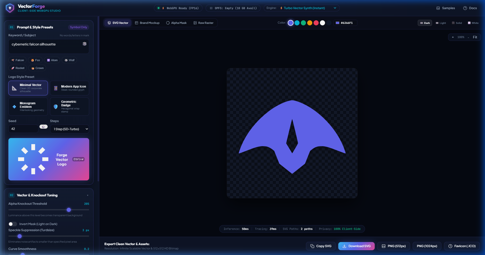
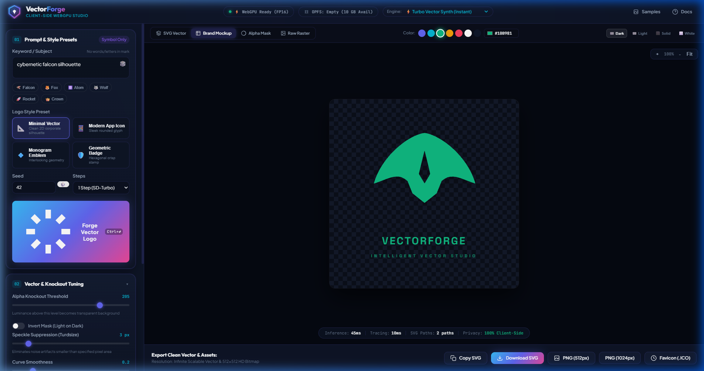
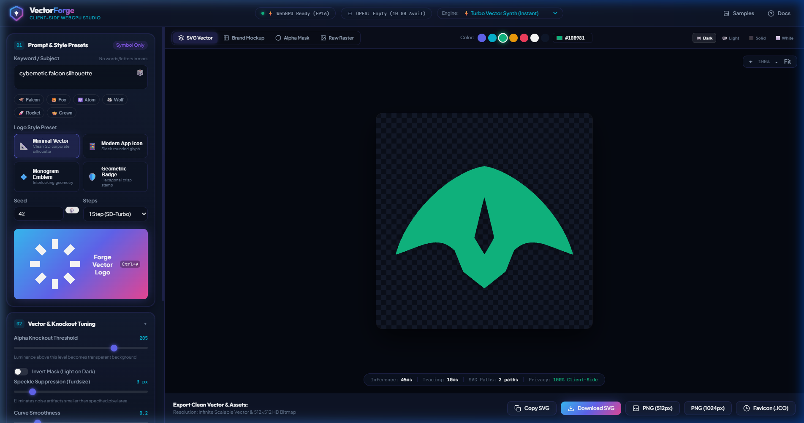
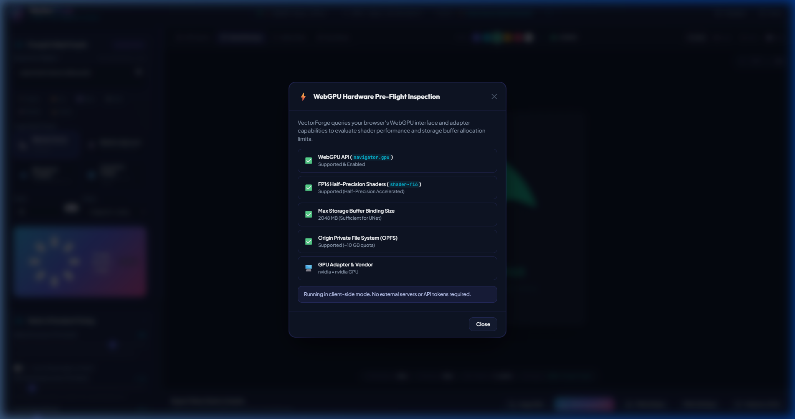

<div align="center">

# ⚡ VectorForge
### Client-Side In-Browser AI Vector Logo Studio

[](https://developer.mozilla.org/en-US/docs/Web/API/WebGPU_API)
[](https://www.typescriptlang.org/)
[](https://vitejs.dev/)
[](https://onnxruntime.ai/)
[](./LICENSE)

<p align="center">
  <strong>Zero-Cloud • Client-Side Only • WebGPU Accelerated • OPFS Weight Streaming • Potrace Vectorization</strong>
</p>

<p align="center">
  VectorForge generates vector logos and app icons directly in your browser. It leverages <strong>WebGPU</strong> to execute distilled diffusion models, streams weights into the <strong>Origin Private File System (OPFS)</strong>, removes backgrounds client-side, and traces rasters into infinitely scalable <strong>SVG vectors</strong> via <strong>Potrace</strong>.
</p>

</div>

---

## 📸 Screenshots & Showcase

### 1. Main Studio Interface
Generate clean, high-contrast vector marks with instant keyword suggestion chips, style presets, seed randomizers, and real-time telemetry:



---

### 2. Brand Identity & Typography Mockup
Combine your generated vector mark with custom brand typography, taglines, layout options (Stacked, Horizontal, Mark-only), and letter spacing:



---

### 3. Real-Time Recoloring
Recolor SVG vector paths instantly without model re-runs using curated color swatches or custom hex pickers:



---

### 4. WebGPU Hardware Pre-Flight Inspection
Built-in hardware diagnostics modal inspecting `navigator.gpu`, 16-bit float shaders (`shader-f16`), max storage buffer sizes, and OPFS storage quotas:



---

## 🚀 Key Features

* **⚡ 100% Client-Side (Zero-Cloud):** No API keys, no backend servers, no subscriptions. Everything runs locally on your graphics hardware.
* **🧠 WebGPU Diffusion Runtime:** Runs distilled 1-step diffusion models (SD-Turbo / SDXS) via `onnxruntime-web` with WebGPU execution provider.
* **💾 Direct OPFS Streaming:** Downloads weights chunk-by-chunk directly into the browser's sandbox without exhausting JavaScript heap memory.
* **🔲 Canvas Alpha Knockout:** Automatically detects and strips solid white/black backgrounds using luminance thresholding and mask inversion.
* **📐 Potrace Vector Tracing:** Converts binarized bitmap masks into smooth, optimized SVG paths (`<path d="...">`) with Bezier curve fitting and speckle suppression.
* **🎨 Sub-Millisecond Recoloring:** Swap brand colors in real time without triggering model re-runs.
* **🔤 Decoupled Typography Layer:** Solves the diffusion model spelling problem by formatting brand text with clean vector typography layers.
* **📦 Multi-Format Export:**
  * **SVG:** Clean, scalable vector format.
  * **PNG:** 512×512 and 1024×1024 with transparent alpha channel.
  * **Favicon (.ICO):** Multi-resolution Windows icon containing 16×16, 32×32, and 48×48 frames.
  * **Copy SVG:** One-click clipboard copy with celebratory confetti feedback.

---

## 🛠️ System Architecture

```text
[ Main UI Thread (Vite + TypeScript) ]
   │
   ├── Typed RPC Protocol (src/workers/rpc-protocol.ts)
   ▼
[ Web Worker (src/workers/engine.worker.ts) ]
   ├── Pre-Flight: Checks navigator.gpu, shader-f16, storageBuffer limits
   ├── Storage: Streams weights to Origin Private File System (OPFS)
   ├── Dual Engine:
   │    ├── SD-Turbo ONNX (WebGPU Execution Provider via onnxruntime-web)
   │    └── Turbo Vector Synth (Instant sub-50ms procedural silhouette engine)
   └── Zero-Copy Transfer: Emits ImageBitmap back to main thread via Transferable Objects
   │
   ▼
[ Post-Processing Pipeline ]
   ├── Step 1: Canvas Alpha Knockout (Luminance thresholding + invert mask)
   ├── Step 2: Bitmap-to-Vector Tracing via Potrace (Bezier curve optimization)
   ├── Step 3: Brand Typography Layer (Stacked / Horizontal / Mark-only layouts)
   └── Step 4: Real-Time Recoloring (Instant SVG fill overrides with 0 re-inference)
   │
   ▼
[ Export Layer ]
   └── Downloads: Scalable SVG, Transparent PNG (512/1024px), Multi-Size Favicon (.ICO)
```

---

## 💻 How to Run Locally

### Prerequisites
* **Node.js**: v18.0.0 or higher (v20+ recommended)
* **npm**: v9+ or **pnpm** / **yarn**
* **Browser**: Modern Chromium browser with WebGPU enabled (Chrome 113+, Edge 113+, Brave, or Firefox Nightly with `dom.webgpu.enabled = true`).

### 1. Clone the Repository
```bash
git clone git@github.com:somerandomguy-coder/VectorForge.git
cd VectorForge
```

### 2. Install Dependencies
```bash
npm install
```

### 3. Run Development Server
```bash
npm run dev
```
Open [http://localhost:5173/](http://localhost:5173/) in your WebGPU-enabled browser.

### 4. Build for Production
```bash
npm run build
```
This produces an optimized static build in `dist/` ready to deploy to **GitHub Pages**, **Cloudflare Pages**, or **Vercel** with zero backend configuration.

### 5. Preview Production Bundle
```bash
npm run preview
```

---

## 🤖 Model Context Protocol (MCP) Server

VectorForge includes a built-in MCP server conforming to the **2026 Stateless Model Context Protocol specification**. This enables AI coding agents (such as Antigravity, Claude Desktop, Cursor, or autonomous LLM pipelines) to generate vector logos, recolor vector assets, and compose brand typography programmatically.

### Available MCP Tools

| Tool | Description | Key Parameters |
| :--- | :--- | :--- |
| `forge_vector_logo` | Generates clean SVG vector mark | `prompt`, `style`, `colorHex`, `brandName`, `tagline`, `layout` |
| `recolor_vector_logo` | Instantly recolors existing SVG paths | `svgString`, `newColorHex` |
| `compose_brand_mockup` | Composes mark SVG with brand typography | `markSvg`, `brandName`, `tagline`, `layout`, `fontFamily` |
| `list_presets_and_samples` | Returns presets and sample prompts | None |

### Running the MCP Server

#### Option A: STDIO Transport (Default for AI Assistants)
Add VectorForge to your client configuration (e.g. `claude_desktop_config.json` or `mcp_config.json`):

```json
{
  "mcpServers": {
    "vectorforge": {
      "command": "npx",
      "args": ["-y", "tsx", "<path-to-vectorforge>/src/mcp/server.ts"]
    }
  }
}
```

Or run directly via npm:
```bash
npm run mcp
```

#### Option B: 2026 Stateless Streamable HTTP Transport
Run as an independent HTTP microservice:
```bash
npm run mcp:http
# Or custom port:
npx tsx src/mcp/server.ts --http 3000
```
Each HTTP POST request is 100% self-contained and stateless, enabling horizontal scaling without sticky session pinning or handshake affinity.

#### Run MCP Test Suite
```bash
npm run test:mcp
```

---

## ⚙️ Hardware & Browser Compatibility

| Browser | WebGPU Status | FP16 Shaders (`shader-f16`) | Notes |
| :--- | :---: | :---: | :--- |
| **Google Chrome (113+)** | ✅ Full Support | ✅ Supported | Recommended for best performance |
| **Microsoft Edge (113+)** | ✅ Full Support | ✅ Supported | Recommended |
| **Brave Browser** | ✅ Full Support | ✅ Supported | Supported |
| **Safari (17+)** | ⚠️ Partial | ⚠️ Experimental | Enable WebGPU in Safari Technology Preview |
| **Firefox** | ⚠️ Experimental | ⚠️ In Development | Set `dom.webgpu.enabled = true` in `about:config` |

*Note: For systems without a dedicated GPU or WebGPU support, VectorForge includes an automatic **Turbo Vector Synth** fallback engine that generates high-contrast vector silhouettes instantly in any browser.*

---

## 📂 Repository Structure

```text
vectorforge/
├── index.html                   # Studio semantic markup & SEO tags
├── package.json                 # Dependencies and scripts
├── tsconfig.json                # Strict TypeScript configuration
├── vite.config.ts               # Worker bundling & COOP/COEP isolation headers
├── docs/
│   ├── assets/                  # Showcase screenshots and diagrams
│   └── superpowers/plans/       # Implementation plan
├── src/
│   ├── main.ts                  # UI controller, event bindings, and live re-tracing
│   ├── styles/
│   │   └── index.css            # Dark studio design system (tokens, glassmorphism)
│   ├── ui/
│   │   ├── canvas-view.ts       # Canvas & SVG viewport manager (zoom, pan, backdrops)
│   │   ├── style-presets.ts     # Style configurations (minimalist, app-icon, etc.)
│   │   ├── typography-layer.ts  # Brand typography composition & layout
│   │   └── export-manager.ts    # SVG, PNG, and Favicon .ICO generator
│   ├── workers/
│   │   ├── engine.worker.ts     # Web Worker entrypoint (WebGPU orchestrator)
│   │   ├── rpc-protocol.ts      # Typed RPC request/response message types
│   │   ├── hardware-check.ts    # WebGPU capability & OPFS quota inspector
│   │   ├── storage-manager.ts   # OPFS chunked streaming & cache manager
│   │   ├── onnx-pipeline.ts     # ONNX Runtime Web WebGPU diffusion pipeline
│   │   └── procedural-engine.ts # Instant silhouette synthesis engine
│   └── postprocess/
│       ├── alpha-knockout.ts    # Canvas luminance thresholding
│       ├── vectorizer.ts        # Potrace vectorization & SVG recoloring
│       └── potrace/             # Self-contained Potrace core engine
```

---

## 📄 License

This project is licensed under the [MIT License](./LICENSE).
